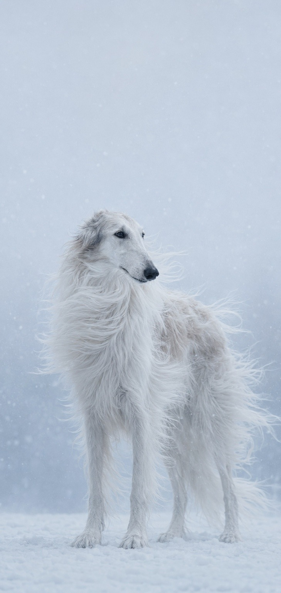
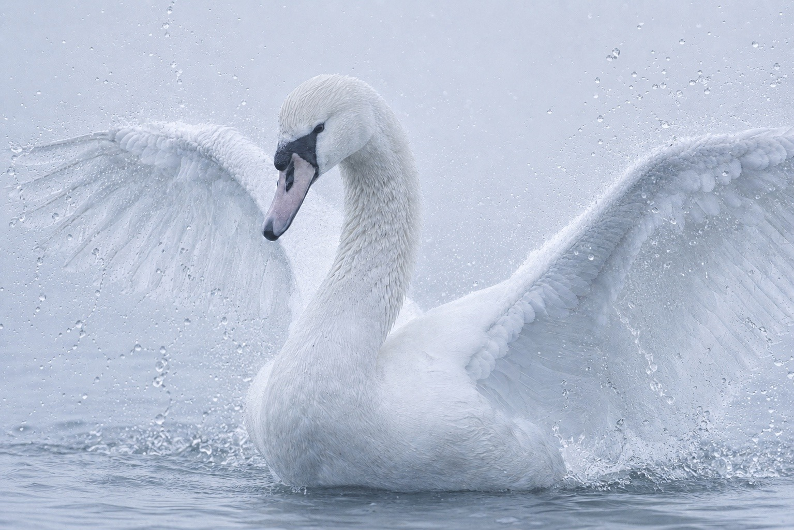
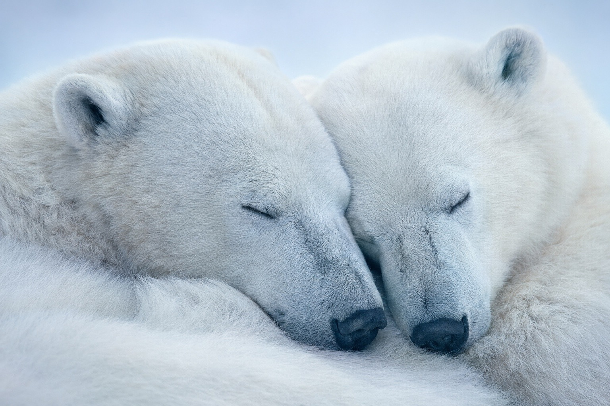
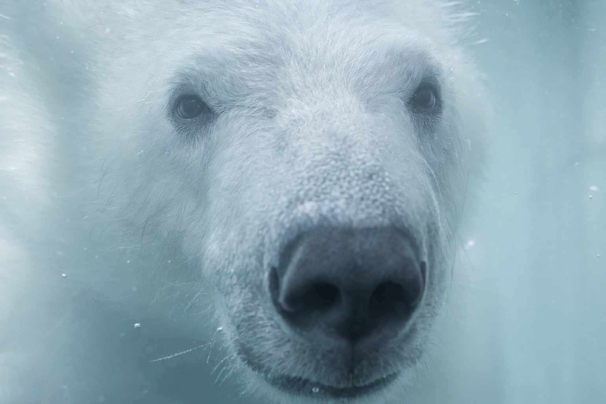
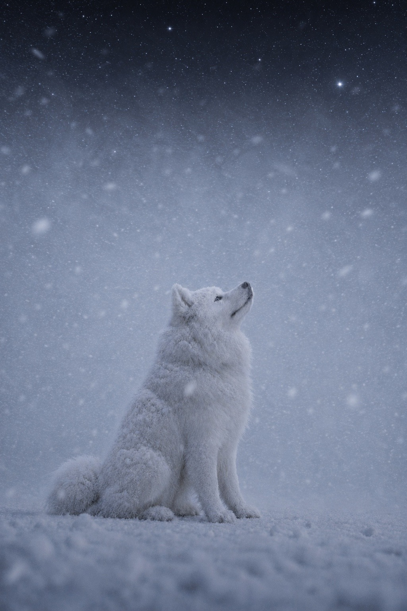
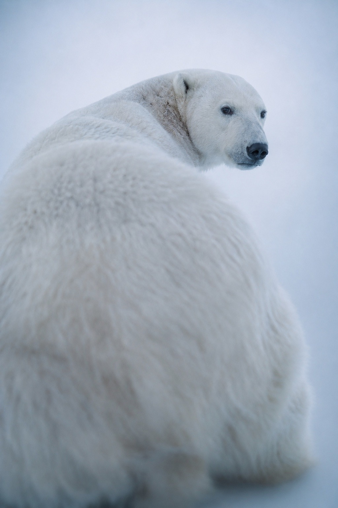
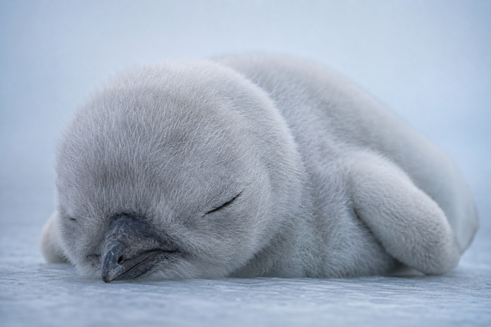

# Frozen Lens / 凍レンズ

A cool, near-monochromatic fine-art style defined by pale blue-white tonality,
compressed but layered shadows, filament-fine fur, restrained wet highlights,
and an intimate camera distance. The name describes the visual tone and does
not require literal ice or frost.

## Example images / 作例

| Borzoi in snowfall / 雪の中のボルゾイ | Swan spreading its wings / 翼を広げる白鳥 | Sleeping polar bears / 眠る白熊 |
| --- | --- | --- |
|  |  |  |

### More examples / その他の作例

| Polar bear underwater / 水中の白熊 | Samoyed stargazing / 星空を見上げるサモエド |
| --- | --- |
|  |  |
| Polar bear looking back / 振り返る白熊 | Sleeping penguin chick / 眠るペンギンの赤ちゃん |
|  |  |

## Replaceable fields

| Field | Description |
| --- | --- |
| Subject | An animal, person, object, or other principal subject |
| Scene | Setting, posture, interaction, weather, or action |

## English prompt

```text
Use case: photorealistic-natural

Primary request:

Depict [subject — scene] as a photorealistic fine-art photograph captured in the “Frozen Lens” style described below.

Style preset — “Frozen Lens”:

Unify the entire frame with a pale blue-white tonality, as though viewed through cold air. Center the palette on nearly monochromatic, low-saturation powder blue, ice blue, pearl white, and pale blue-gray. Preserve the subject’s original colors only as extremely faint residual traces.

Use soft, wraparound diffused light, as though the subject were surrounded by a vast overcast light source. Keep the image high-key without clipping the whites, preserving fine surface information even in the brightest areas. Restrict the highlights to a range between pale ice blue and pearl white rather than allowing them to become glowing pure white. Do not use hard light beams, strong reflected glare, or dramatic spotlights.

Keep the tonal range quiet and compressed, but not flat. Within white surfaces, layer numerous subtle shades of blue-gray, lead gray, and pale gray-violet. Do not surround shadows with black, outline-like edges. Instead, let them recede gradually into the depth of each surface. Concentrate the darkest values in only a few areas, such as the eyes, nostrils, underside of the nose, and the thin line of a closed mouth.

Render fur and fibers not as thick lines or sculpted grooves, but as extremely fine, semi-translucent filaments. Short fur should first read as a smooth surface, with the direction and overlap of individual hairs becoming visible only upon closer inspection. For long fur, layer countless fine strands with subtly varied thickness, density, translucency, length, and spacing. Preserve blue-gray roots and narrow shadows in the gaps beneath pale fur, naturally including fine crossings, small clumps, and stray hairs.

Base the eyes on deep black-brown, preserving internal gradations of ink black, blue-black, and dark gray-violet. Maintain an overall impression of blackness while rendering depth behind the cornea and an extremely subdued blue-gray surface reflection. Add a small white reflection and a thin line of light along the moist eyelid, both kept restrained. Do not make the eyes resemble large glass marbles. Keep the shadow around the eyes localized along the eyelids in blue-gray tones, fading softly toward the cheeks.

Do not render the nose or other wet surfaces as uniform black. Within cool charcoal gray, show fine texture, subtle irregularities, mottling, pores, and muted moisture. Make the nostrils the deepest shadows, and place a broad, weak blue-gray reflection across the center of the nose. Define the mouth through a thin, irregular dark line and a faint reflection immediately above it.

Place the camera close enough that it feels as though the photographer’s breath could touch the subject. Create an atmosphere that is quiet, cold, and intimate, with a faint sting beneath it—a coexistence of unease and tenderness. Convey the physical weight of a living presence and the sense of extremely slow breathing.

Optics:

Fine-art photography, shallow depth of field, soft lens diffusion, and extremely fine analog film grain. The eyes, nose, and selected areas of fur within the focal plane may be highly detailed, but do not make the entire frame digitally sharp. Let the background dissolve into an unidentifiable haze of pale blue.

Constraints:

“Frozen Lens” is the name of the tonal style. It does not mean that actual ice, frost, snow, ice crystals, or frozen surfaces should be depicted. Do not include text, logos, or watermarks.

Avoid:

Warm lighting; strong yellow or orange color casts; clipped whites; glowing fur; hard shadows; black outlines; excessive contrast; thick fur strands; wire-like hairs; excessive sharpness; plastic textures; the glossy finish of commercial photography; enormous eyes; conspicuous catchlights; fantasy effects.
```

## 日本語プロンプト

```text
Use case: photorealistic-natural

Primary request:

［被写体・場面］を、以下の「凍レンズ」スタイルで撮影したフォトリアルなファインアート写真として描く。

Style preset — 「凍レンズ」:

画面全体を、冷たい空気を通したような淡い青白色で統一する。ほぼ単色に近い低彩度のパウダーブルー、氷青、真珠白、淡い青灰色を中心とし、本来の色はごく薄い残響としてだけ残す。

大きな曇天光源に包まれたような、柔らかく回り込む拡散光。高明度だが白飛びさせず、明部にも微細な表面情報を残す。ハイライトは発光する純白ではなく、薄い氷青から真珠白の範囲に抑える。硬い光線、強い照り返し、劇的なスポットライトは使わない。

階調は静かで圧縮されているが、平坦にはしない。白い面の内部に、ごく細かな青灰色、鉛色、薄い灰紫色の陰影を何層も重ねる。影は輪郭線のように黒く囲わず、面の奥へなだらかに沈ませる。最暗部は瞳、鼻孔、鼻の下面、閉じた口の細い線など、限られた箇所へ集中させる。

毛や繊維は、太い線や彫刻状の溝ではなく、極細で半透明なフィラメントとして描く。短い毛はまず滑らかな面として見え、拡大すると一本ずつの方向と重なりが現れる。長い毛は、太さ、濃度、透過率、長さ、間隔が少しずつ異なる無数の細線を重ねる。淡い毛の下に青灰色の根元や隙間の影を残し、細かな交差、毛束、飛び毛も自然に含める。

瞳は深い黒褐色を基調に、墨黒、青黒、暗い灰紫の濃淡を内部に残す。黒い印象を保ちながら、角膜の奥行きとごく鈍い青灰色の面反射を描く。小さな白い反射と、湿ったまぶたの細い光を控えめに入れる。大きなガラス玉のような目にはしない。目元の影はまぶたに沿う局所的な青灰色とし、頬へ向かって柔らかく消す。

鼻や濡れた表面は一様な黒ではなく、冷たいチャコールグレーの中に微細な凹凸、斑点、毛穴、鈍い湿度を描く。鼻孔は最も深い影とし、鼻の中央には広く弱い青灰色の反射を置く。口は細く不均一な暗い線と、その直上のわずかな反射で存在させる。

被写体へ息が触れそうな近い距離感。静かで冷たく、親密だがわずかにヒリつく、不穏さと慈しさが同居した空気。生命の重さと、ごく遅い呼吸が感じられること。

Optics:

ファインアート写真、浅い被写界深度、柔らかなレンズ拡散、微細なアナログフィルム粒子。焦点面の瞳、鼻、毛の一部は精細だが、画面全体をデジタル的に鋭くしすぎない。背景は識別できない淡い青い霞へ溶かす。

Constraints:

「凍レンズ」は画調の名称であり、実際の氷、霜、雪、氷晶、凍結した表面を描くという意味ではない。文字、ロゴ、透かしは入れない。

Avoid:

暖色の照明、黄色や橙色への強い偏り、白飛び、発光する毛、硬い影、黒い輪郭線、過剰なコントラスト、太い毛、針金状の毛、過度なシャープネス、プラスチックの質感、広告写真のような艶、巨大な瞳、派手なキャッチライト、ファンタジー演出。
```

## License

Licensed under [CC BY 4.0](../LICENSE.md). Copying, adaptation, and commercial
use are permitted with attribution.
