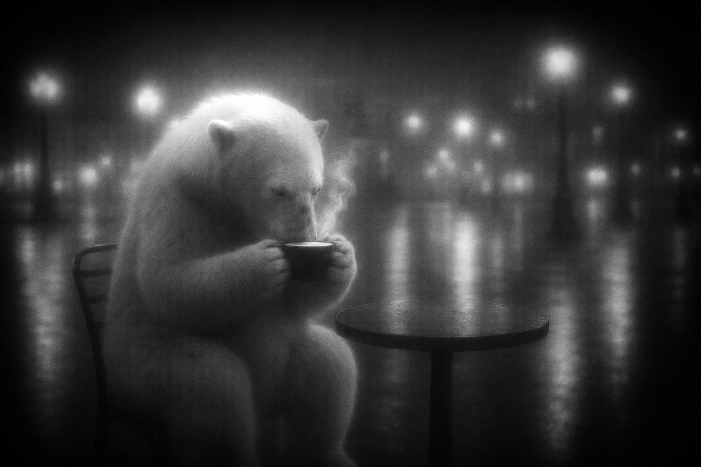
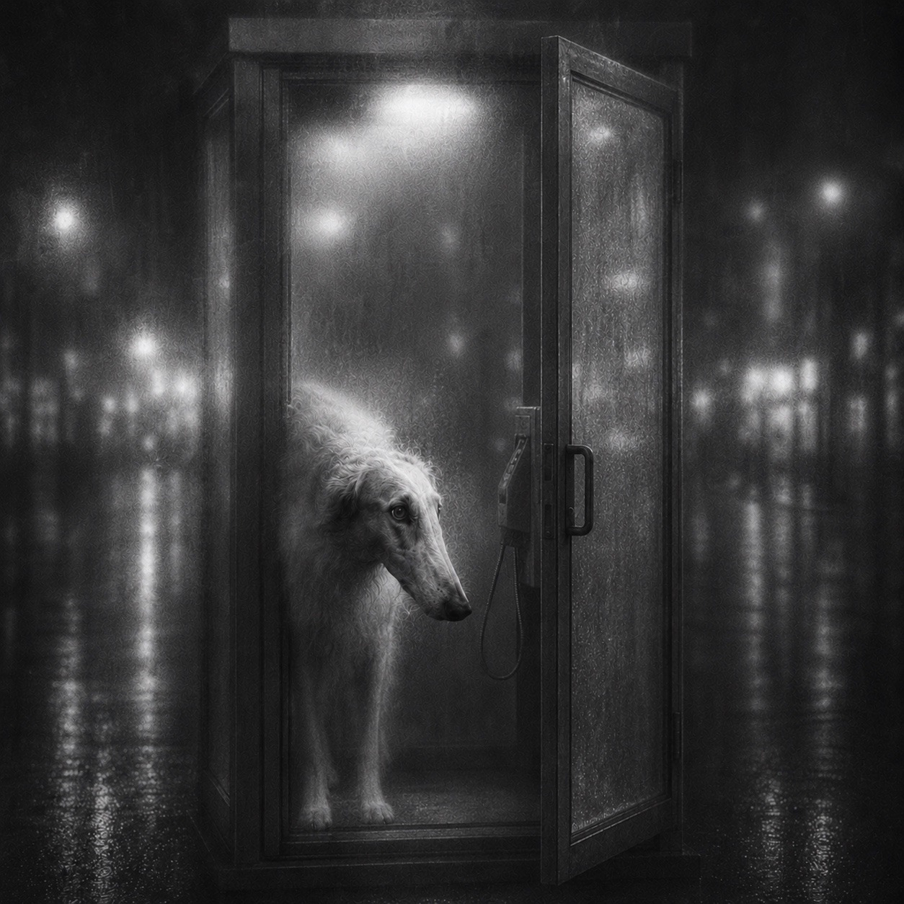
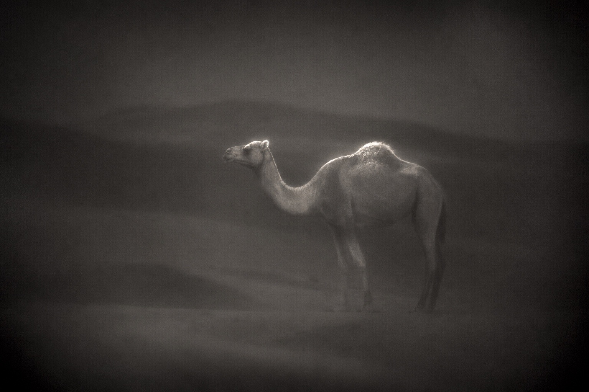

# Glass Monochrome Lens / グラスモノクローム

A silver-gelatin monochrome style that evokes viewing the world through
frosted glass using lens-side optical diffusion alone, with deep black
vignetting, one concentrated pearl-white highlight, and softly dissolving form.

## Example images / 作例

| Polar bear with a steaming cup / 湯気の立つカップを持つ白熊 | Borzoi in a phone booth / 電話ボックスのボルゾイ | Camel standing in the desert / 砂漠に立つラクダ |
| --- | --- | --- |
|  |  |  |

## Replaceable fields

| Field | Description |
| --- | --- |
| Subject | An animal, person, object, or other principal subject |
| Action | The subject’s gesture, movement, or interaction |
| Location | An open indoor or outdoor setting |
| Composition | Framing, distance, camera height, and spatial arrangement |
| Gentle legibility target | The one detail needed to understand the action |
| Strong highlight location | A small surface or edge that receives the brightest light |

## English prompt

```text
Use case: photorealistic-natural

Primary request:

Depict [subject — action — location — composition] as a photorealistic monochrome fine-art photograph captured through the “Glass Monochrome Lens” described below.

Gentle legibility target:

[An eye, nose tip, rim of a cup, steam, ear, fingertip, petal, or another single detail needed to read the action]

Strong highlight location:

[The top of the head, edge of an ear, shoulder, part of the back, rim of a white vessel, or another small area]

Style preset — “Glass Monochrome Lens”:

Place no actual frosted glass within the frame. Create the impression that the world lies beyond frosted glass solely through strong optical diffusion inside the lens. Do not depict a view through a window, a glass surface, window frames, condensation, droplets, scratches, or patterns in a clouded surface. The space itself must remain unobstructed and open.

Use a completely monochrome palette centered on sooty black, charcoal, smoky dark gray, soft silver gray, and pearl white. Add no sepia, blue, green, or other color cast.

Apply strong deep-black vignetting to all four corners and outer edges. Sink the periphery into velvet-like black and direct attention toward the central subject. However, do not create a hard oval frame or the appearance of a black hole; dissolve the darkness smoothly as natural vignetting from an old lens.

Do not illuminate the entire subject evenly. Concentrate strong pearl-white to silver-white light only on [strong highlight location], making that narrow area the brightest point in the frame. Let the white highlight bloom softly into its surroundings. As distance from it increases, sink the subject’s contour and surface information into smoky gray.

Do not render white fur, feathers, skin, cloth, or similar materials strand by strand or in fine detail. Preserve only the light-struck areas as soft white planes, and dissolve everything else indistinctly into black and gray gradations. Let parts of the contour disappear into the background; do not define the whole subject like a cutout.

Place no exact focus resembling a digital photograph anywhere in the frame. However, preserve quiet focus on [gentle legibility target] just enough to understand what is happening. Do not make even that point sharp; retain softness in which the edges of fine detail loosen slightly.

As though using a strong vintage optical diffusion filter, give the entire frame a milky-white veil, low microcontrast, slight localized image drift, soft spherical aberration, and minor focus displacement. Do not use a simple Gaussian blur or uniform fog. Create uneven diffusion in which only the light expands while only the contours in dark areas quietly break down.

Create broad, soft halation around bright areas such as streetlights, interior lights, the moon, and reflected light. Do not preserve the light source’s shape clearly; depict it as an irregular mass of light bleeding from white into gray. Do not arrange numerous tiny point sources. Give the lights quiet differences in brightness and size.

When light is reflected on wet ground or water, do not render pavement joints, droplets, ripples, or reflection contours in fine detail. Express reflected light as large boundaryless pools of gray or thick vertical bands of broken light. Melt multiple reflections into one another until what they reflect can no longer be identified.

Use fine monochrome grain that appears inherent to a silver-gelatin emulsion rather than digital noise overlaid afterward. Blend the grain throughout the frame, creating natural fluctuations that feel pale in bright areas and slightly denser in dark areas. Deliberately suppress apparent resolution and preserve the softness of an enlarged old silver-gelatin photograph.

Base the tonal range on low contrast while tightening the frame with black at the edges and one point of strong white. Let the midtones continue like smoke, avoiding abrupt transitions from black to white. Depict only part of the subject emerging from darkness while the rest returns to the night.

Keep the composition quiet and observational, with the distance of a private moment accidentally photographed while no one was watching rather than a staged portrait. Include solitude, intimacy, quiet humor, and the faintest mystery, but do not turn the image into horror photography or dramatic noir.

Preserve natural body structure, limbs, joints, posture, and contact with objects. Even when the rendering is indistinct, make [what the subject is doing] clearly legible through posture, gaze, contour, and spatial relationships.

Constraints:

A photorealistic silver-gelatin monochrome photograph. Use no actual frosted glass or window; create the texture only through lens-side optical diffusion. Preserve the relationship between the subject’s action and the principal object. Do not include text, logos, watermarks, or decorative borders.

Avoid:

Actual frosted glass; window frames; the boundary of a glass pane; condensation; water droplets; scratches; patterned glass; translucent screens; uniform fog covering the frame; hard oval vignetting; uniform blown highlights across the entire body; excessive detail in fur or ground; sharply defined pavement joints; overly thin reflected light; sharp digital sharpening; HDR; excessive edge enhancement; complete defocus that makes the action unreadable; intense noir aesthetics; horror imagery; illustration; CGI; extra people or animals; extra limbs or objects.
```

## 日本語プロンプト

```text
Use case: photorealistic-natural

Primary request:

［被写体・動作・場所・構図］を、以下の「グラスモノクローム」レンズで撮影した、フォトリアルなモノクロームのファインアート写真として描く。

穏やかな判読性を残す対象：

［目、鼻先、カップの縁、湯気、耳、指先、花びらなど、動作を読み取るために必要な一点］

強いハイライトを置く場所：

［頭頂部、耳の縁、肩、背中の一部、白い器の縁など］

Style preset — 「グラスモノクローム」:

実物のすりガラスを画面内に置かず、レンズ内部の強い光学拡散だけで、まるですりガラスの向こう側に世界があるような質感を作る。窓越しの構図、ガラス面、窓枠、結露、水滴、傷、曇った面の模様などは描かない。空間自体は遮られておらず、開放されている。

色彩は完全なモノクローム。煤けた黒、木炭色、煙のような濃灰色、柔らかな銀灰色、真珠白を中心とする。セピア、青、緑などの色味は加えない。

画面の四隅と外縁には、深い黒のビネットを強く入れる。周辺はベルベットのような黒へ沈ませ、中央の被写体へ視線を集める。ただし、硬い楕円形の枠や黒い穴のようにはせず、古いレンズの自然な周辺減光として滑らかに溶かす。

被写体全体を均等に明るくしない。［強いハイライトを置く場所］だけに、真珠白から銀白の強い光を集中させ、その狭い範囲を画面内で最も明るくする。ハイライトは白く輝きながら周囲へ柔らかくブルームし、そこから離れるほど被写体の輪郭と表面情報を煙のような灰色へ沈ませる。

白い毛、羽、肌、布などは、一本一本の細部を描き込まない。光が当たった部分だけを柔らかな白い面として残し、それ以外は黒と灰色の階調へ朧げに溶かす。輪郭の一部を背景へ消失させ、被写体全体を切り抜きのように明瞭にしない。

画面内のどこにも、デジタル写真のような厳密なピントを置かない。ただし、［穏やかな判読性を残す対象］だけは、何が起きているか理解できる程度に静かな焦点を残す。そこも鋭利にはせず、細部の縁がわずかにほどける柔らかさを保つ。

強めのヴィンテージ光学拡散フィルターを通したように、画面全体へ乳白色のベール、低いマイクロコントラスト、軽い局所的な像の流れ、柔らかな球面収差、わずかな焦点のずれを与える。単純なガウスぼかしや一様な霧ではなく、光だけが膨らみ、暗部の輪郭だけが静かに崩れる不均一な拡散とする。

街灯、室内灯、月、反射光などの明部には、広く柔らかなハレーションを生じさせる。光源の形をくっきり残さず、白から灰色へ滲む不定形の光の塊として描く。小さな点光源を大量に並べず、明るさと大きさに静かな差をつける。

濡れた地面や水面に光が映る場合、舗装の目地、水滴、波紋、反射の輪郭を細かく描かない。反射光は、境界のない大きな灰色の溜まりや、縦方向へ崩れた太い光の帯として表現する。複数の反射を互いに溶かし、何が映っているのか判別できない程度まで曖昧にする。

粒子は、後から重ねたデジタルノイズではなく、銀塩フィルムの乳剤に内在するような細かなモノクロ粒子とする。粒子を画面全体へ馴染ませ、明部では淡く、暗部ではやや密に感じられる自然な揺らぎを作る。解像感は意図的に抑え、古い銀塩写真を引き伸ばしたような柔らかさを残す。

階調は低コントラストを基調としながら、周辺の黒と一点の強い白によって画面を引き締める。中間調は煙のように連続させ、黒から白への移行を急激にしない。被写体の一部だけが暗闇から浮かび、残りは夜へ戻っていくように描く。

構図は静かで観察的なものとし、演出されたポートレートよりも、誰にも見られていない時間を偶然撮影したような距離感を持たせる。孤独、親密さ、静かな可笑しみ、ごく薄い不思議さを含ませるが、恐怖写真や劇的なノワールにはしない。

被写体の身体構造、手足、関節、姿勢、物との接触関係は自然に保つ。表現を朧げにしても、［被写体が何をしているか］は、姿勢、視線、輪郭、距離関係から明確に読み取れるようにする。

Constraints:

フォトリアルな銀塩モノクロ写真。実物のすりガラスや窓を使わず、レンズ側の光学拡散のみで質感を作る。被写体の動作と主要な物体の関係は維持する。文字、ロゴ、透かし、装飾的な枠は入れない。

Avoid:

実物のすりガラス、窓枠、ガラス板の境界、結露、水滴、傷、型板ガラスの模様、半透明のスクリーン、画面を覆う一様な霧、硬い楕円形のビネット、全身の均一な白飛び、毛や地面の過剰な細密描写、くっきりした舗装の目地、細すぎる反射光、鋭いデジタルシャープネス、HDR、過度な輪郭強調、完全なピンぼけで動作が読めない状態、激しいノワール調、ホラー表現、イラスト、CG、余分な人物や動物、余分な手足や物体。
```

## License

Licensed under [CC BY 4.0](../LICENSE.md). Copying, adaptation, and commercial
use are permitted with attribution.
