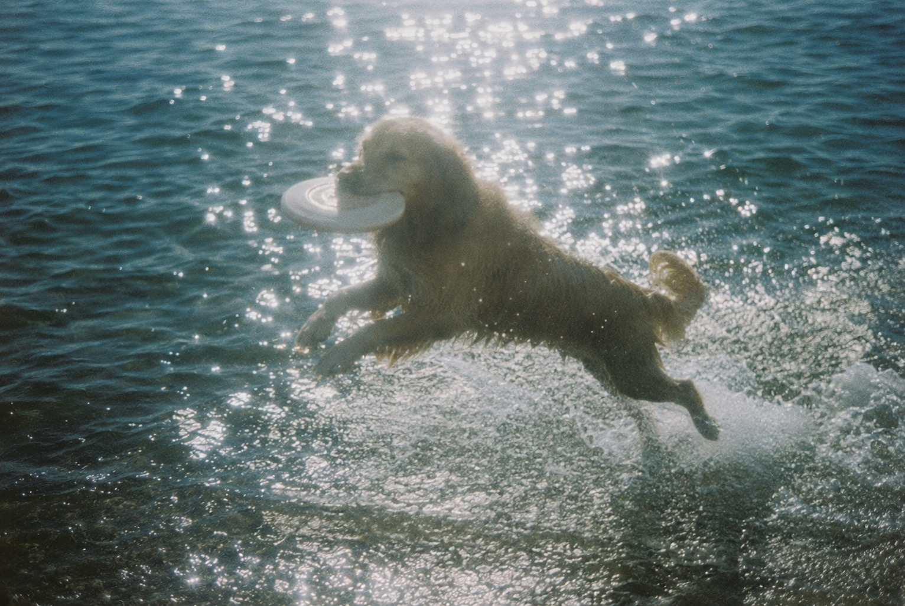
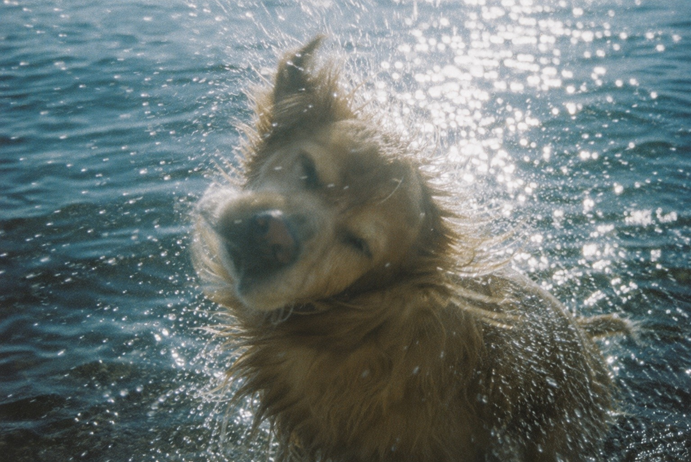
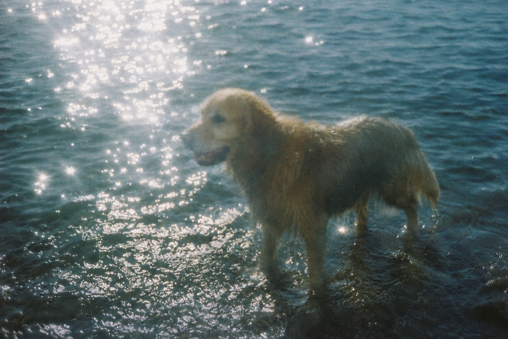

# Nostalgic Summer Lens / ノスタルジックサマー

An aged midsummer waterside-film style: intense backlit water glare,
blue-green color-negative drift, coarse emulsion grain, imperfect focus and
motion, humid air, happiness, and a faint sense of distance.

## Example images / 作例

| Golden Retriever leaping with a flying disc / フライングディスクをくわえて跳ぶゴールデンレトリバー | Golden Retriever shaking off water / 水を振り払うゴールデンレトリバー | Golden Retriever standing in the shallows / 浅瀬に立つゴールデンレトリバー |
| --- | --- | --- |
|  |  |  |

## Replaceable fields

| Field | Description |
| --- | --- |
| Subject | Animal, person, object, or group |
| Action | Jumping, running, shaking off water, playing, resting, or another action |
| Camera distance | Close-up, medium shot, long shot, and so on |
| Camera angle | Low water-level view, rear view, side view, or another angle |
| Summer waterside setting | Sea, riverbank, lake, beach, shallows, or another summer scene |

## English prompt

```text
Use case: photorealistic-natural

Primary request:

Depict [subject — action — camera distance — camera angle — summer waterside setting] as a photorealistic film photograph captured in the “Nostalgic Summer Lens” style described below.

Style preset — “Nostalgic Summer Lens”:

Render the image like an old photograph that was accidentally taken beside the water in midsummer and rediscovered many years later. Do not directly stage or emphasize enjoyment. Instead, evoke the quiet, slightly distant feeling of a summer remembered only through dazzling water, humid air, and the indistinct figure of the subject.

Base the entire image on deep blue containing a slight trace of green. Center the palette on teal blue, blue-green navy, muted cyan, and pale blue-gray. Preserve the subject’s inherent warm colors only in restrained, desaturated shades of gold, brown, and skin tone. Avoid vivid tropical turquoise and strong orange. Spread a faint blue-green color cast characteristic of old color-negative film across the entire image.

Introduce strong summer sunlight from behind the subject or from a diagonal rear angle. Render reflected light on the water not as a uniform layer of fine glitter, but as clusters of silver-white light composed of irregularly mixed large, medium, and small fragments. Let the light gather into bands, islands, and splash-like shapes following the movement of the water, creating distinct areas of dense brightness and dark empty space. Allow the most intense areas to blow out locally to white, with soft halation spreading outward from milky white into pale blue. Do not create star-shaped sparkles or decorative circular bokeh. Depict water glare so dazzling that its precise forms can no longer be recognized.

Use a wide contrast range without applying modern HDR correction. Allow the water highlights to blow out boldly, while the backlit subject’s face, chest, and underside sink into dark shadows containing blue-green. Do not artificially lift the shadows. Preserve areas where parts of the expression or fur remain difficult to see. However, do not turn the subject into a completely black silhouette. Retain the minimum amount of information necessary to understand its form and movement within the coarse grain. Let some detail disappear in both the highlights and shadows, as though limited by the narrow dynamic range of film.

Do not isolate the subject with a perfectly sharp contour. Allow parts of its outline to dissolve into reflected light, spray, humid air, and film grain. Do not render the face, eyes, fur, and limbs with equal precision. Let only certain areas become briefly visible, while others disappear into missed focus or motion blur. The subject and its action must remain identifiable, but avoid overexplaining the individual details of the subject. If the subject is an animal with wet fur, render the fur as uneven, waterlogged clumps. Mix areas that cling to the body, areas that hang downward, and areas that lag behind the body’s movement or the wind. Do not render individual hairs like sharp needles.

Do not completely freeze a moving subject with a high shutter speed. Preserve very slight subject motion blur, softness of focus, and directional flow along the movement of a jump, run, body shake, or splash, without producing visibly doubled contours. Do not freeze every water droplet like a gemstone. Mix individual droplets, short streaks of light, and larger masses of white spray. Even with a stationary subject, retain slight handheld camera movement and imperfect focus.

Give the photograph the texture of an image shot with an old 35mm compact film camera. Preserve large, coarse film grain across the entire frame, adding low apparent resolution, optical softness, uneven exposure, color bleeding, slight fading, a faint veil-like flare, and mild vignetting. The grain must not resemble uniform digital noise added afterward. Integrate it as grains of photographic emulsion that construct the subject, water, light, and shadow alike. Make the image appear coarsely resolved, but do not turn it into pixel art or introduce blocky JPEG compression artifacts.

Do not arrange the composition as neatly as a commercial photograph. Place the camera at a low position near the water’s surface, offset the subject slightly from the center, and capture the movement at a moment that feels just a little too early or too late. Do not emphasize the horizon. Let the water and reflected light occupy most of the frame. Do not strongly separate the subject from the background; place both within the same grain, the same blue-green air, and the same backlight.

The overall impression should not be summer at its most lively, but a summer memory in which only dazzling light and the sound of water remain in fragments. Freshness, humidity, happiness, and a trace of loneliness should coexist. The image must feel like an accidental private snapshot rather than a deliberately staged emotional scene.

Constraints:

The image must remain convincing as a real summer film photograph. Preserve the subject’s species or type, posture, action, and anatomical structure. Large variations in the density of reflected water light, a blue-green color cast, localized blown highlights, coarse low-resolution texture, and indistinct rendering of the subject must all coexist. Do not include text, logos, or watermarks.

Avoid:

Modern, pristine digital image quality; excessive sharpness; HDR; crisp commercial photography; perfect focus; lighting that illuminates the entire body evenly; excessively smooth tonal gradations; uniform digital noise; a water surface covered uniformly in fine glitter; decorative circular bokeh; star-shaped sparkles; strong rings of lens flare; vivid tropical colors; cinematic orange-and-teal color grading; individually sharpened hairs; gemstone-like frozen droplets; hard cutout contours; CGI; illustration; excessive sepia; text; logos; watermarks.
```

## 日本語プロンプト

```text
Use case: photorealistic-natural

Primary request:

［被写体・動作・撮影距離・撮影角度・夏の水辺の情景］を、以下の「ノスタルジックサマー」スタイルで撮影した、フォトリアルなフィルム写真として描く。

Style preset — 「ノスタルジックサマー」:

真夏の水辺で偶然撮影され、長い年月を経て見つかった古い写真のように表現する。楽しさを直接演出するのではなく、眩しい水面、湿った空気、被写体の曖昧な姿だけが記憶として残っているような、静かで少し遠い夏の感触を持たせる。

画面全体は、緑をわずかに含んだ深い青を基調とする。ティールブルー、青緑を帯びた濃紺、くすんだシアン、淡い青灰色を中心にし、被写体本来の暖色は彩度を落とした金色、茶色、肌色として控えめに残す。鮮やかな南国のターコイズや強いオレンジにはせず、古いカラーネガフィルム特有の青緑がかった色偏りを画面全体に薄く行き渡らせる。

強い夏の日差しを、被写体の背後または斜め後方から入れる。水面の反射光は、均一な細かなラメではなく、大粒、中粒、小粒が不規則に混ざった白銀の光の群れとして表現する。光は水面のうねりに沿って帯状、島状、飛沫状に集まり、密集する場所と暗い空白をはっきり作る。最も強い部分は局所的に白飛びさせ、周辺へ乳白色から淡い水色のハレーションを柔らかく広げる。星形の輝きや装飾的な玉ボケではなく、眩しさのため形を正確に認識できなくなった水面光として描く。

明暗差は大きいが、現代的なHDR補正は行わない。水面の光は大胆に飛ばし、逆光になった被写体の顔、胸、腹側は青緑を含んだ暗い影へ沈ませる。暗部を無理に持ち上げず、表情や毛並みの一部が見えにくい状態を残す。ただし完全な黒いシルエットにはせず、粗い粒子の中に姿や動作を読み取れる最低限の情報を残す。フィルムの狭いダイナミックレンジによって、光と影の双方で細部が少し失われているようにする。

被写体は鮮明に切り抜かず、水面光、飛沫、湿った空気、フィルム粒子へ輪郭の一部を溶かす。顔、目、毛、四肢を均等に精細化せず、ある部分だけが一瞬見え、ほかはピントのずれや動きのブレへ消えるようにする。被写体であることと動作は判別できるが、個体の細部を説明しすぎない。濡れた毛のある動物の場合、毛は水を含んだ太さの不揃いな束にし、身体に張り付く部分、垂れる部分、動きや風で遅れて揺れる部分を混在させる。一本ずつ針のように描写しない。

動いている被写体は、高速シャッターで完全に静止させない。跳躍、走行、身震い、水飛沫などの方向に沿って、ごく軽い被写体ブレ、焦点の甘さ、輪郭の二重化しない程度の流れを残す。水滴も一粒ずつ宝石のように固定せず、粒、短い光跡、白い飛沫の塊を混在させる。静止している被写体にも、手持ち撮影によるわずかな揺れと不完全な合焦を残す。

古い35mmのコンパクトフィルムカメラで撮影したような質感にする。画面全域に大きく粗いフィルム粒子を残し、低い解像感、光学的な甘さ、露光むら、色のにじみ、わずかな退色、淡いベール状のフレア、軽い周辺減光を加える。粒子は後から重ねた均一なデジタルノイズではなく、被写体、水、光、影のすべてを構成する乳剤の粒として馴染ませる。画素が粗いように見せるが、ピクセルアートや四角いJPEG圧縮ノイズにはしない。

構図は広告写真のように整えすぎない。カメラを水面に近い低い位置へ置き、被写体を中央からわずかに外し、動きの途中を少し早すぎる、または遅すぎるタイミングで捉える。水平線は目立たせず、水面と反射光が画面の大部分を占めるようにする。被写体と背景を強く分離せず、どちらも同じ粒子、同じ青緑の空気、同じ逆光の中に存在させる。

全体の印象は、賑やかな夏そのものではなく、眩しさと水音だけが断片的に残った夏の記憶。爽やかさ、湿度、幸福感、少しの寂しさが同時に存在する。演出された感動ではなく、偶然残った一枚の私的なスナップ写真として成立させる。

Constraints:

実在する夏のフィルム写真として成立すること。被写体の種類、姿勢、動作、解剖学的構造は保つ。水面光の大きな疎密、青緑の色調、局所的な白飛び、粗い低解像感、曖昧な被写体描写を必ず共存させる。文字、ロゴ、透かしは入れない。

Avoid:

現代的で清潔なデジタル画質、過剰なシャープネス、HDR、鮮明な広告写真、完璧な合焦、全身を均等に照らす光、滑らかすぎる階調、均一なデジタルノイズ、細かなラメを一面に配置した水面、装飾的な玉ボケ、星形の輝き、強いレンズフレアの輪、鮮やかな南国色、オレンジとティールの映画的配色、一本ずつ鮮明な毛、宝石状に静止した水滴、輪郭の硬い切り抜き、CG、イラスト、過剰なセピア、文字、ロゴ、透かし。
```

## License

Licensed under [CC BY 4.0](../LICENSE.md). Copying, adaptation, and commercial
use are permitted with attribution.

