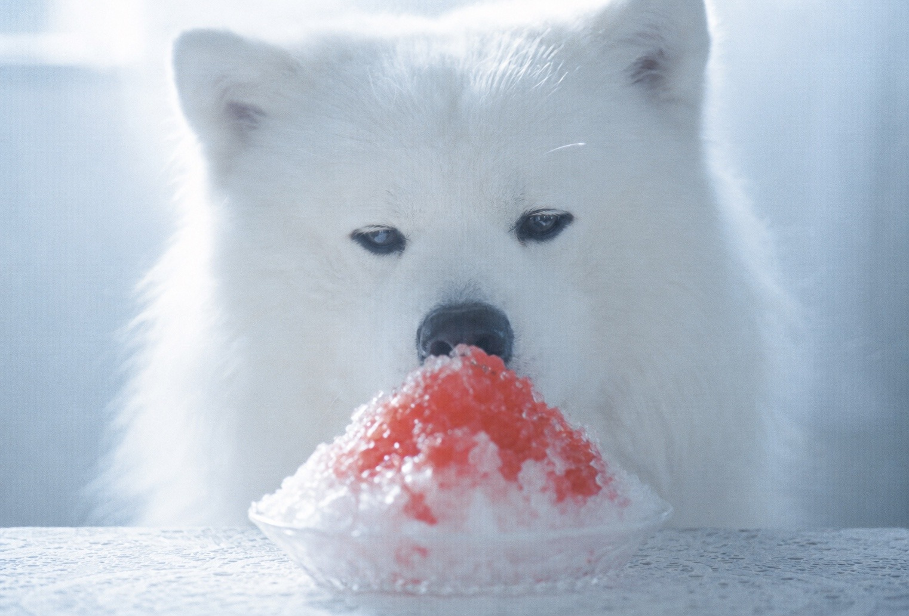
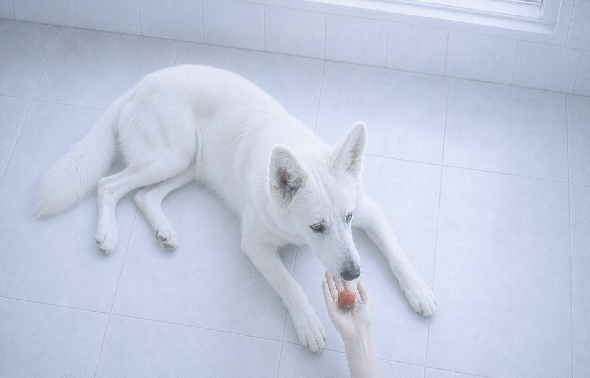
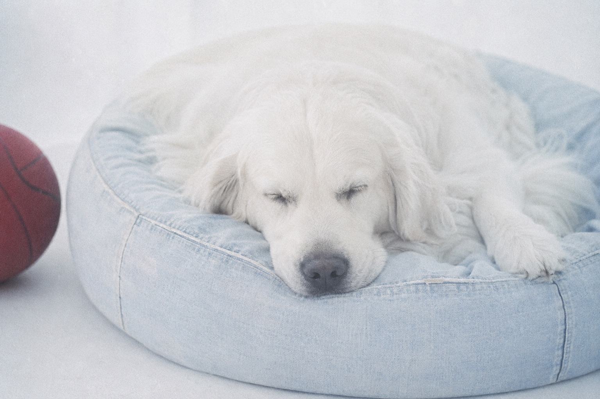
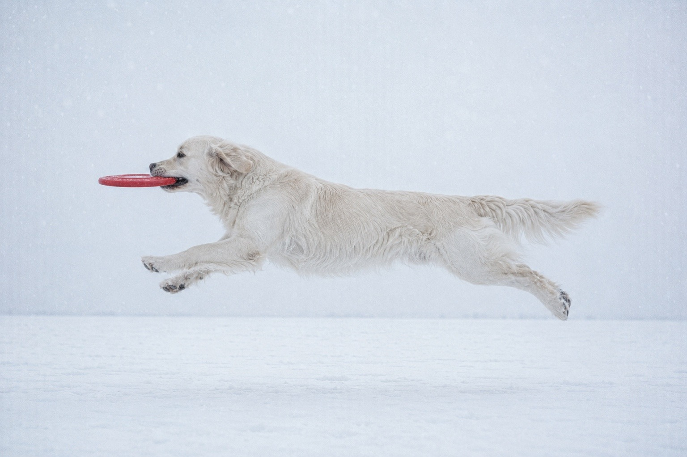

# Powder Snow Lens / 粉雪

A fragile, high-key fine-art film style built around pale blue-white tonality,
dense fine grain, gentle focus, softened surface detail, and a single restrained
red accent. The name describes the color and optical treatment and does not
require literal snow, ice, frost, or white particles.

## Example images / 作例

| White dog with red shaved ice / 赤いかき氷を見つめる白い犬 | White shepherd offered a strawberry / イチゴを差し出される白いシェパード |
| --- | --- |
|  |  |

### More examples / その他の作例

| Sleeping English Golden Retriever with a basketball / 赤いバスケットボールのそばで眠るイングリッシュゴールデンレトリバー | English Golden Retriever catching a red flying disc / 赤いフライングディスクをキャッチするイングリッシュゴールデンレトリバー |
| --- | --- |
|  |  |

## Replaceable fields

| Field | Description |
| --- | --- |
| Main subject | The principal person, animal, object, or other subject |
| Action | The main subject’s gesture, movement, or interaction |
| Location | The setting in which the scene takes place |
| Surrounding objects | Nearby objects that establish the scene |
| Camera distance | Close-up, medium shot, long shot, or another distance |
| Camera position | Camera height, direction, and angle relative to the subject |
| Composition | Framing, negative space, and spatial arrangement |
| Gentle focus target | The single detail needed to understand the scene |
| Red accent | The only clearly retained color in the frame |

## English prompt

```text
Use case: photorealistic-natural

Primary request:

Depict [main subject — action — location — surrounding objects — camera distance — camera position — composition] as a photorealistic fine-art film photograph captured through the “Powder Snow Lens” described below.

Gentle focus target:

[The main subject’s eyes, nose, fingertips, point of contact with a red object, or another single detail needed to understand the scene]

Red accent:

[A strawberry, red syrup, flower petals, fruit, a small object, or another red element]
Keep red as the only clearly retained color in the frame, and let all other local colors dissolve into the blue-white air.

Style preset — “Powder Snow Lens”:

Fill the entire frame with white containing a trace of very pale blue. Center the palette on pearl white, milky white, pale powder blue, ice blue, and blue-tinged light gray, bringing it together in low saturation that approaches monochrome. Treat white not as neutral pure white, but as cold, translucent white containing fine blue-gray gradations.

Make the photograph bright and high-key, but do not achieve this merely by raising the exposure until the image clips to white. Preserve extremely faint blue-gray shading within white fur, skin, floors, fabric, walls, and other surfaces so their contours and overlapping planes remain quietly legible. Do not close down the dark areas into black; lift them to a soft charcoal gray as though covered by a thin layer of powder snow. Only necessary features such as the eyes, nose, and mouth should become quiet dark notes that support the pale frame.

Use broad, soft diffused light resembling illumination entering through a large window or from an overcast sky. Rather than striking hard from one direction, let the light wrap faintly around the subject and make white contours glow subtly. Add a slight bloom of white light to the brightest tips of fur, areas of skin, wet fruit, ice, or the rim of a vessel. Do not use hard rays, sharply edged shadows, or dramatic spotlights.

Keep contrast and microcontrast low, and do not render every detail with hard precision. Do not separate fur into meticulously defined individual strands; let soft white masses coexist with fine indications of hair flow. Materials such as tile, fabric, skin, and ice should remain recognizable without the sharp surface rendering of commercial photography. Let parts of the contours dissolve faintly into the blue-white air, preserving a fragility that feels as though it might crumble at a touch.

Distribute dense, extremely fine analog film grain evenly across the entire frame. The grain must remain present even in highlights and white surfaces, blending subject, background, and light into the same emulsion. Make the grains extremely small, irregular, and tactile without destroying contours. Do not turn them into coarse digital noise, sand, snow crystals, white point particles, repeating patterns, swirling or worm-like noise, or an embossed surface.

Do not establish exact focus. Bring only the specified focus target into enough gentle focus to remain legible. Do not give even that point digital sharpness; let its surroundings loosen progressively, one degree at a time. Do not rely only on large depth-of-field blur. Use a thin optical veil, low resolving power, and fine grain to blend the entire frame quietly together.

Let only the red accent rise out of the blue-white world. Center its color on translucent ruby red through soft crimson, with small white glints on wet or illuminated areas. Do not make it glow like neon; soften its saturation and contours slightly, as though viewed through a single white veil. Do not let it shift strongly toward orange, yellow, or magenta.

Keep the composition quiet and simple. Reserve broad negative space in white or pale blue, limit the number of objects, and make the distance, gaze, or almost-touching relationship between the main subject and the red accent legible. Rather than explaining everything, compose the frame as though only one small event remained within a white space.

To keep a white subject from merging excessively with a white background, preserve extremely faint blue-gray shading at points of contact with the ground, where limbs overlap, and just inside the silhouette. Keep the correct number and natural connections of animal legs, paws, ears, and tails and of human fingers; do not let them disappear into the white. Preserve the boundaries and perspective between different planes such as floor and wall or table and background so the subject does not appear to pierce or merge into them.

Unify the overall impression around something cold but not severe, clean but not inorganic, quiet, thin, and fragile. This is not a snowscape itself; express a photograph in which light, white, blue-gray, and grain cover the frame like powder snow.

Constraints:

* A photorealistic live-action film photograph
* Unify everything except red in low-saturation blue-white
* Preserve faint tonal gradations and surface information within white
* Do not over-render anything outside the focus target
* Preserve the subject’s species or type, body structure, and individual characteristics
* Do not omit or fuse limbs, paws, fingers, ears, or tails
* Do not break spatial relationships among floors, walls, windows, tables, and other surfaces
* Do not include text, logos, or watermarks

Avoid:

Featureless pure-white clipping; hard HDR; excessive sharpness; high microcontrast; yellow or green color casts; deep navy blue; strong black; vivid multicolor palettes; hard shadows; coarse digital noise; repeating grain patterns; composited snowflakes; glitter; decorative frost or ice crystals; plastic-looking skin; individually emphasized hairs; excessively sharp backgrounds; fused objects; unnatural perspective.

Important:

“Powder Snow Lens” is the name of the color and optical treatment. Do not add snow, ice, frost, or white floating particles unless the request explicitly calls for them.
```

## 日本語プロンプト

```text
Use case: photorealistic-natural

Primary request:

［主役・動作・場所・周囲の物・撮影距離・カメラ位置・構図］を、以下の「粉雪」レンズで撮影した、フォトリアルなファインアート・フィルム写真として描く。

穏やかに焦点を置く対象：

［主役の目、鼻先、指先、赤い物との接点など、場面を理解するために必要な一点］

赤い差し色：

［イチゴ、赤いシロップ、花びら、果実、小物など］
赤は画面内で唯一はっきり残る色とし、それ以外の固有色は青白い空気の中へ溶かす。

Style preset — 「粉雪」:

画面全体を、ごく薄い青を含んだ白で満たす。真珠白、ミルキーホワイト、淡いパウダーブルー、氷青、青みを帯びた薄灰色を中心とし、ほぼ単色に近い低彩度へまとめる。白は無彩色の純白ではなく、細かな青灰色の階調を内包した、冷たく透けるような白として扱う。

明るくハイキーな写真にするが、単純に露出を上げて白飛びさせない。白い毛、肌、床、布、壁などの内部には、ごく淡い青灰色の陰影を残し、輪郭や面の重なりが静かに判読できるようにする。暗部は黒く締めず、粉雪が薄く積もったような柔らかなチャコールグレーまで持ち上げる。目、鼻先、口元など必要な部分だけが、淡い画面を支える静かな暗色になる。

大きな窓や曇天から入るような、広く柔らかな拡散光を使う。光は一方向から強く射すのではなく、被写体の周囲へ薄く回り込み、白い輪郭をほのかに発光させる。最も明るい毛先、肌、濡れた果実、氷や器の縁には、白い光がわずかににじむハレーションを加える。硬い光線、輪郭の鋭い影、劇的なスポットライトは使わない。

コントラストとマイクロコントラストを低く抑え、細部を一つずつ硬く描き込まない。毛は一本ずつ精密に分離せず、柔らかな白い面と細かな毛流れが共存する程度にする。タイル、布、肌、氷なども素材は読み取れるが、商業写真のような鋭い質感描写にはしない。輪郭の一部が青白い空気へ薄く溶け、触れると崩れてしまいそうな危うさを残す。

画面全域に、密度の高い微細なアナログフィルム粒子を均等に重ねる。粒子は明部や白い面にも消えずに存在し、被写体、背景、光を同じ乳剤の中へなじませる。粒は極めて細かく、不規則で、輪郭を壊さない程度に触覚的であること。粗いデジタルノイズ、砂粒、雪の結晶、白い点状パーティクル、反復する模様、渦状・虫状のノイズ、エンボス加工のような表面にはしない。

厳密なピントは作らず、指定した焦点対象だけを穏やかに読み取れる程度に合わせる。そこにもデジタル的な鋭さは与えず、その周囲は一段ずつ柔らかくほどいていく。被写界深度による大きなボケだけで処理せず、光学的な薄いベール、低い解像感、微細な粒子によって画面全体を静かになじませる。

赤い差し色だけは、青白い世界から浮き上がるように残す。色は透明感のあるルビー赤から柔らかな深紅を中心とし、濡れた部分や光の当たる箇所に、小さく白い輝きを入れる。ただしネオンのように発光させず、白いベールを一枚通したように彩度と輪郭をわずかに柔らげる。オレンジ、黄色、マゼンタへ大きく転ばせない。

構図は静かで簡潔にする。白や淡い青の余白を広く取り、物の数を抑え、主役と赤い差し色の距離や視線、接触寸前の関係が読み取れるようにする。説明的にすべてを見せるのではなく、白い空間の中に小さな出来事だけが残っているような画面にする。

白い被写体と白い背景が同化しすぎないよう、接地部分、四肢の重なり、輪郭の内側にごく淡い青灰色の陰影を残す。動物の脚、足先、耳、尾、人の指などは正しい数と自然な接続を保ち、白の中へ消失させない。床と壁、机と背景など異なる面の境界と遠近関係を守り、被写体が壁や床へ突き刺さったように見せない。

全体の印象は、冷たいが厳しくなく、清潔だが無機質ではなく、静かで、薄く、壊れやすいものにする。雪景色そのものではなく、光、白、青灰色、粒子が粉雪のように画面を覆っている写真として表現する。

Constraints:

* フォトリアルな実写フィルム写真
* 赤以外は低彩度の青白色へ統一する
* 白の内部に淡い階調と表面情報を残す
* 焦点対象以外を過度に精細化しない
* 被写体の種類、身体構造、個体特徴を維持する
* 四肢、足先、指、耳、尾を欠損・融合させない
* 床、壁、窓、机などの空間関係を破綻させない
* 文字、ロゴ、透かしを入れない

Avoid:

純白一色の白飛び、硬いHDR、過剰なシャープネス、高いマイクロコントラスト、黄色や緑の色かぶり、濃い紺色、強い黒、派手な多色表現、硬い影、粗いデジタルノイズ、反復する粒子模様、雪片の合成、ラメ、霜や氷晶の装飾、プラスチックのような肌、一本ずつ強調された毛、過度に鮮明な背景、物体同士の融合、不自然な遠近法。

重要：

「粉雪」は色調と光学表現の名称であり、依頼に明記されていない雪、氷、霜、白い浮遊物を画面へ追加しない。
```

## License

Licensed under [CC BY 4.0](../LICENSE.md). Copying, adaptation, and commercial
use are permitted with attribution.
