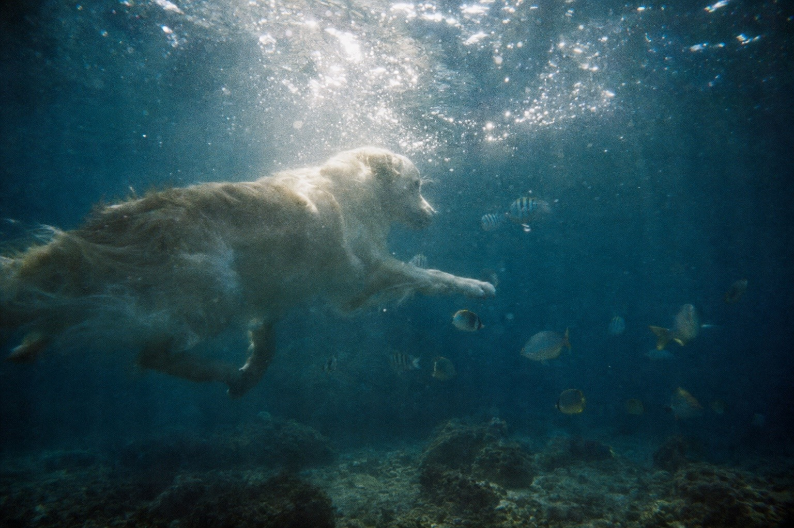
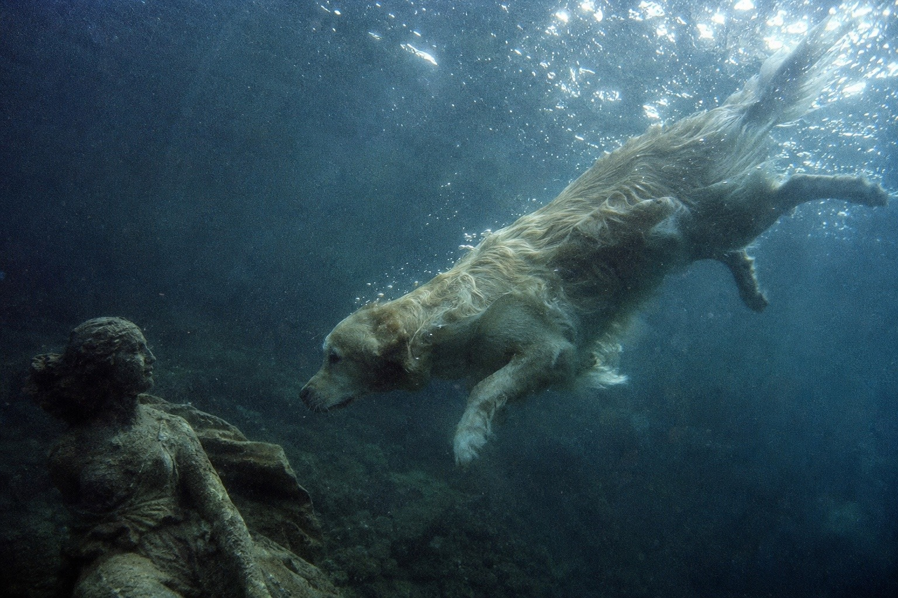
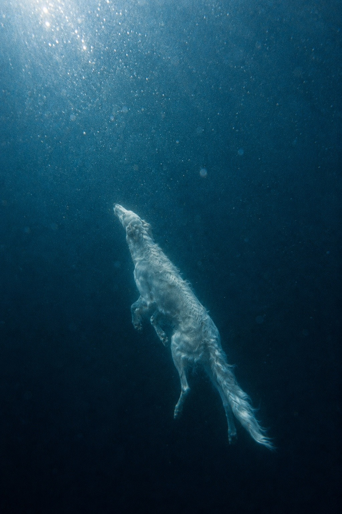
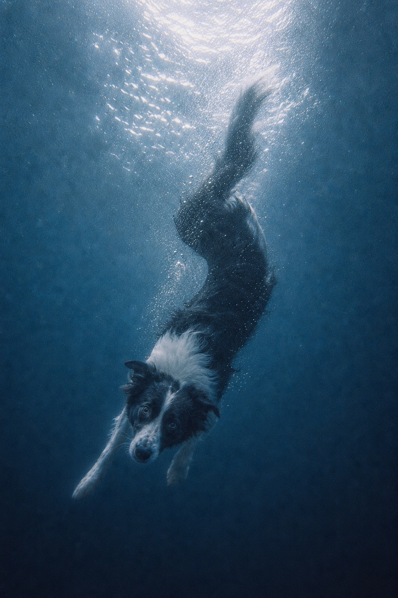
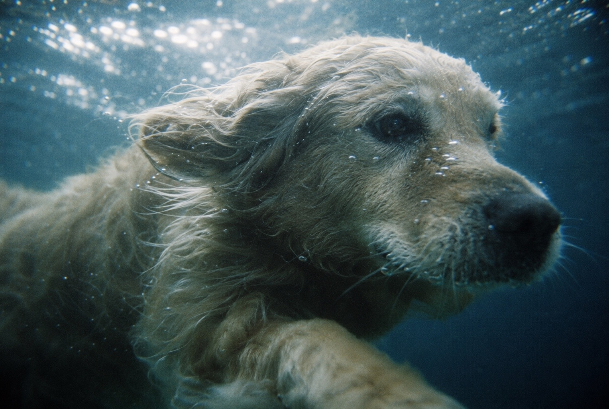
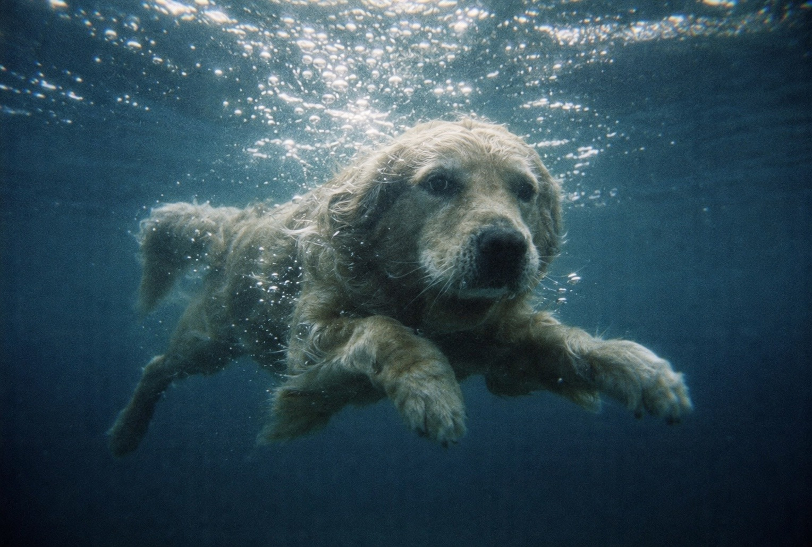
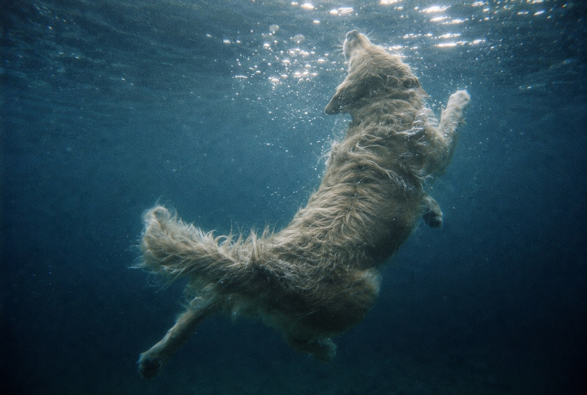
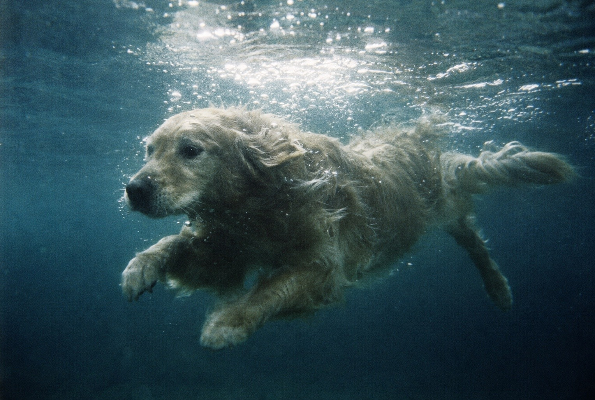

# Underwater Fur Lens / 水中毛並みレンズ

A photographic style preset for fur-bearing animals photographed entirely
underwater: cold blue-green depth, shattered surface light, waterlogged fur,
suspended matter, and the coarse optical softness of old 35mm film.

## Example images / 作例

| English Golden Retriever swimming among fish / 魚と泳ぐイングリッシュゴールデンレトリバー | English Golden Retriever approaching a submerged statue / 水中の彫像に近づくイングリッシュゴールデンレトリバー |
| --- | --- |
|  |  |

### More examples / その他の作例

| Borzoi swimming toward the surface / 水面へ泳ぐボルゾイ | Border Collie diving underwater / 水中へ潜るボーダーコリー | English Golden Retriever underwater close-up / 水中のイングリッシュゴールデンレトリバーの接写 |
| --- | --- | --- |
|  |  |  |
| English Golden Retriever swimming toward the camera / カメラへ泳ぐイングリッシュゴールデンレトリバー | English Golden Retriever turning toward the surface / 水面へ身をひねるイングリッシュゴールデンレトリバー | English Golden Retriever swimming sideways / 横向きに泳ぐイングリッシュゴールデンレトリバー |
|  |  |  |

## Replaceable fields

| Field | Description |
| --- | --- |
| Subject | An animal with fur |
| Action | Swimming, turning, rising, diving, playing, or another underwater movement |
| Camera distance | Close-up, medium shot, distant view, and so on |
| Camera angle | From above, below, level with the subject, or another specified viewpoint |

## English prompt

```text
Use case: photorealistic-natural

Primary request:

Depict [animal with fur — action — camera distance — camera angle] as a photorealistic underwater film photograph shot in the “Underwater Fur Lens” style defined below.

Style preset — “Underwater Fur Lens”:

Fill the entire frame with blue that carries deep green undertones. Base the palette on deep teal blue, dark cyan, and navy with a blue-green cast, transitioning only near the water’s surface into a muted, pale blue-white. Do not use vivid tropical turquoise; render the setting as cold, deep seawater with a palpable sense of depth. Preserve the subject’s natural fur color, but allow it to strongly reflect the underwater blue-green cast while suppressing saturation and warmth.

Break the light entering from the water’s surface into irregular white flecks and fragments rather than smooth shafts of light. Do not distribute the flecks evenly like fine glitter. Let large, medium, and extremely fine flecks form irregular clusters, bands, and empty spaces with varying density. The brightest flecks may locally blow out to white, with only their immediate surroundings swelling softly through film halation. Allow their edges to bleed slightly while preserving the irregular mass of each individual fleck. They should not resemble decorative circular bokeh or star-shaped sparkles, but light momentarily shattered by the moving water surface and bubbles.

Make the water near the surface bright and luminous, then let it fall off rapidly into dark blue-green at greater depth. Do not illuminate the entire range from highlights to shadows evenly. Only parts of the subject should catch the light, while the underside and the side facing deeper water dissolve into dense blue-green shadow. Allow local highlights to blow out boldly, but do not crush the shadows to pure black; retain coarse grain and faint traces of fur within them.

Render the fur not as dry, fluffy volume, but as waterlogged strands and clumps. Mix sections that lie flat along the body, sections that unravel into fine drifting strands in the current, and sections that undulate as thick locks. Long fur around the ears, cheeks, neck, chest, belly, and tail should float dimensionally, pulled by the current, with only the brighter tips catching the light. Do not resolve every individual strand with equal sharpness. Let only a few foreground hairs remain visible, while the rest dissolve into underwater haze, suspended particles, and motion blur. Do not give the subject a clean, cutout-like edge; in places, allow its contours to merge with the water, bubbles, light, and film grain.

Give the image the texture of a chance photograph captured with an underwater camera loaded with old 35mm film. Retain large, coarse film grain throughout the frame, along with low apparent resolution, slightly missed focus, optical softness, mild subject motion blur, color bleeding, uneven exposure, and vignetting. This should not look like ordinary digital noise or JPEG compression. The roughness should feel as though the image itself is constructed from grains of photographic emulsion. The image may appear to have a low pixel count, but it must not resemble pixel art or contain blocky, square compression artifacts.

Let fine suspended matter and bubbles of varying sizes drift throughout the water, while the distant background naturally disappears into a blue-green haze. Do not make the water excessively transparent or give it the homogeneous background of a swimming pool. Convey the thickness, turbidity, refraction, and attenuation of light within the water. If the water’s surface is visible within the frame, distort it like a wavering membrane and gather the fractured light behind it.

Do not make the composition feel like an overly polished animal photograph. Preserve natural movement captured in mid-swim: asymmetrical limb positions, a naturally twisting torso, and fur or a tail that moves with a slight delay behind the surrounding current. The image should feel as though the photographer happened to capture a fleeting instant by chance. The subject must remain identifiable as its species and anatomically accurate, but its face and contours should not be rendered with excessive literal detail or sharpness. Give the photograph a quiet, deep atmosphere that faintly resembles an image recalled from memory.

Constraints:

Both the subject and the camera must be fully submerged. The fur, water, bubbles, and light must interact naturally within the same physical space. The result must be photorealistic and convincing as a genuine underwater film photograph. Do not include text, logos, or watermarks.

Avoid:

Modern, pristine digital image quality; excessive sharpness; HDR; uniform digital noise; smooth CGI; crystal-clear water; vivid tropical colors; cinematic orange-and-teal color grading; uniformly distributed fine glitter; decorative circular bokeh; hard-edged light beams; dry fur; individual hairs rendered needle-sharp; cutout-like contours; plastic textures; illustrative rendering; extra legs or ears; malformed anatomy.
```

## 日本語プロンプト

```text
Use case: photorealistic-natural

Primary request:

［毛のある動物・動作・撮影距離・撮影角度］を、以下の「水中毛並みレンズ」スタイルで撮影した、フォトリアルな水中フィルム写真として描く。

Style preset — 「水中毛並みレンズ」:

画面全体を、緑を深く内包した青で満たす。深いティールブルー、暗いシアン、青緑を帯びた濃紺を中心とし、水面に近い部分だけを低彩度の淡い青白色へ移行させる。鮮やかな南国のターコイズにはせず、深度のある冷たい海水として表現する。被写体本来の毛色は残すが、水中の青緑を強く反映させ、彩度と暖色を抑える。

水面から差し込む光は、滑らかな光線ではなく、大きさの不揃いな白い光の粒や欠片へ砕く。粒は細かなラメ状に均一配置せず、大粒、中粒、ごく細かな粒が疎密を作りながら、不規則な群れ、帯、空白を形成する。強い粒は局所的に白飛びし、その周囲だけがフィルムのハレーションで淡く膨らむ。輪郭はわずかに滲ませながらも、一粒ごとの不均一な塊は残す。装飾的な玉ボケや星形の輝きではなく、水面の揺れと気泡によって瞬間的に砕かれた光として表現する。

水面付近は明るく発光し、深部へ向かうほど急速に暗い青緑へ沈ませる。明部から暗部まで均等に照らさず、被写体の一部だけが光を拾い、腹側や水深側は濃い青緑の影へ溶けるようにする。ハイライトは局所的に大胆に飛ばす一方、暗部は完全な黒潰れにせず、粗い粒子とわずかな毛並みを残す。

毛は乾いたふわふわした形ではなく、水を含んだ束として表現する。身体に沿って寝る部分、水流にほどけて細く漂う部分、太い房のまま波打つ部分を混在させる。耳、頬、首、胸、腹、尾などの長い毛は、水流に引かれて立体的に浮遊し、明るい毛先だけが光を拾う。一本一本を均等に鮮明化せず、手前の数本だけが見え、残りは水中の霞、粒子、動きのブレへ溶ける。被写体の輪郭も切り抜いたように明確にせず、場所によって水、気泡、光、フィルム粒子と混ざり合う。

古い35mmフィルムを装填した水中カメラで偶然撮影したような質感にする。画面全域に大きく粗いフィルム粒子を残し、低い解像感、わずかなピントのずれ、光学的な甘さ、軽い被写体ブレ、色のにじみ、露光むら、周辺減光を加える。単なるデジタルノイズやJPEG圧縮ではなく、乳剤の粒が像そのものを構成しているような粗さにする。画素が少ないように見えるが、ピクセルアートや四角い圧縮ノイズにはしない。

水中には微細な浮遊物と大小の気泡を漂わせ、遠景は青緑の霞へ自然に消失させる。透明すぎる水やプールのような均質な背景にはせず、水の厚み、濁り、屈折、光量の減衰を感じさせる。水面が画面内に見える場合は、揺らぐ膜のように歪ませ、その裏側に砕けた光を集める。

構図は整いすぎた動物写真にせず、泳いでいる途中の非対称な四肢、ひねられた胴体、流れに遅れて動く毛や尾など、撮影者が一瞬を偶然捉えたような自然な動きを残す。被写体は種として識別でき、解剖学的な正確さを保つが、顔や輪郭を過度に説明的・鮮明にしない。静かで深く、少し記憶の中の映像に似た空気を持たせる。

Constraints:

被写体とカメラは完全に水中にある。毛、水、気泡、光が同じ空間内で自然に干渉していること。フォトリアルで、実在する水中フィルム写真として成立させる。文字、ロゴ、透かしは入れない。

Avoid:

現代的で清潔なデジタル画質、過剰なシャープネス、HDR、均一なデジタルノイズ、滑らかなCG、水晶のように透明な水、鮮やかな南国色、オレンジとティールの映画的配色、均一な小粒ラメ、装飾的な玉ボケ、硬い光線、乾いた毛、一本ずつ針のように鮮明な毛、切り抜き状の輪郭、プラスチック質感、イラスト調、余分な脚や耳、崩れた骨格。
```

## License

Licensed under [CC BY 4.0](../LICENSE.md). Copying, adaptation, and commercial
use are permitted with attribution.
